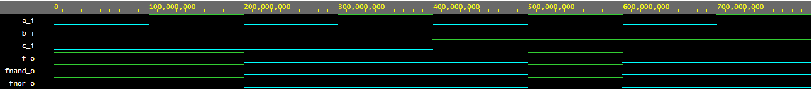
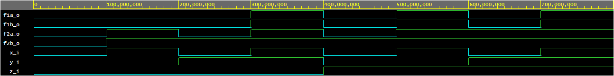

## DE1 LAB1
# 1. GitHub link: https://github.com/xrysav25
# 2. De Morganovy zákony
   * Kód design.vhd
```
------------------------------------------------------------------------
--
-- Example of basic OR, AND, XOR gates.
-- Nexys A7-50T, Vivado v2020.1, EDA Playground
--
-- Copyright (c) 2019-2020 Tomas Fryza
-- Dept. of Radio Electronics, Brno University of Technology, Czechia
-- This work is licensed under the terms of the MIT license.
--
------------------------------------------------------------------------

library ieee;               -- Standard library
use ieee.std_logic_1164.all;-- Package for data types and logic operations

------------------------------------------------------------------------
-- Entity declaration for basic gates
------------------------------------------------------------------------
entity gates is
    port(
        a_i    : in  std_logic;         -- Data input
        b_i    : in  std_logic;         -- Data input
        c_i	 : in  std_logic;
        f_o  : out std_logic;         -- OR output function
        fnand_o : out std_logic;         -- AND output function
        fnor_o : out std_logic          -- XOR output function
    );
end entity gates;

------------------------------------------------------------------------
-- Architecture body for basic gates
------------------------------------------------------------------------
architecture dataflow of gates is
begin
    --for_o  <= a_i or b_i;
    --fand_o <= a_i and b_i;
    --fxor_o <= a_i xor b_i;
	f_o <= ((not b_i) and a_i) or ((not c_i) and (not b_i));
    fnand_o <= (not ((not ((not b_i) and a_i)) and (not ((not c_i) and (not b_i)))));
    fnor_o <= (not (b_i or (not a_i))) or (not (c_i or b_i));
end architecture dataflow;
```
   * 
   * [playground](https://www.edaplayground.com/x/vb3G)
   * tabulka:
    a | b | c | f(a,b,c)
    --|---|---|---------
    0 | 0 | 0 | 1
    0 | 0 | 1 | 1
    0 | 1 | 0 | 0
    0 | 1 | 1 | 0
    1 | 0 | 0 | 0
    1 | 0 | 1 | 1
    1 | 1 | 0 | 1
    1 | 1 | 1 | 0

# 3. Distributivní zákony
   * kód
    ```
    ------------------------------------------------------------------------
    --
    -- Example of basic OR, AND, XOR gates.
    -- Nexys A7-50T, Vivado v2020.1, EDA Playground
    --
    -- Copyright (c) 2019-2020 Tomas Fryza
    -- Dept. of Radio Electronics, Brno University of Technology, Czechia
    -- This work is licensed under the terms of the MIT license.
    --
    ------------------------------------------------------------------------
    
    library ieee;               -- Standard library
    use ieee.std_logic_1164.all;-- Package for data types and logic operations
    
    ------------------------------------------------------------------------
    -- Entity declaration for basic gates
    ------------------------------------------------------------------------
    entity gates is
        port(
            x_i    : in  std_logic;         -- Data input
            y_i    : in  std_logic;         -- Data input
            z_i	 : in  std_logic;
            f1a_o  : out std_logic;
            f1b_o  : out std_logic;
            f2a_o  : out std_logic;
            f2b_o  : out std_logic
        );
    end entity gates;
    
    ------------------------------------------------------------------------
    -- Architecture body for basic gates
    ------------------------------------------------------------------------
    architecture dataflow of gates is
    begin
        f1a_o <= ((x_i and y_i) or (x_i and z_i));
        f1b_o <= (x_i and (y_i or z_i));
        f2a_o <= ((x_i or y_i) and (x_i or z_i));
        f2b_o <= (x_i or (y_i or z_i));
        
    end architecture dataflow;
    ```
   * 
   * [playground](https://www.edaplayground.com/x/pkwS)

