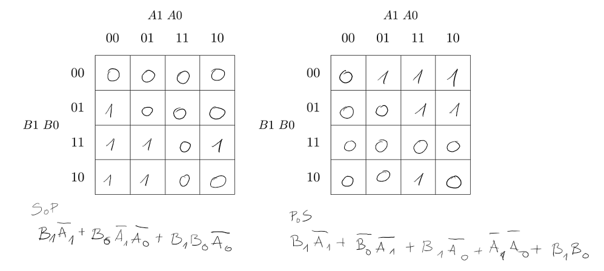
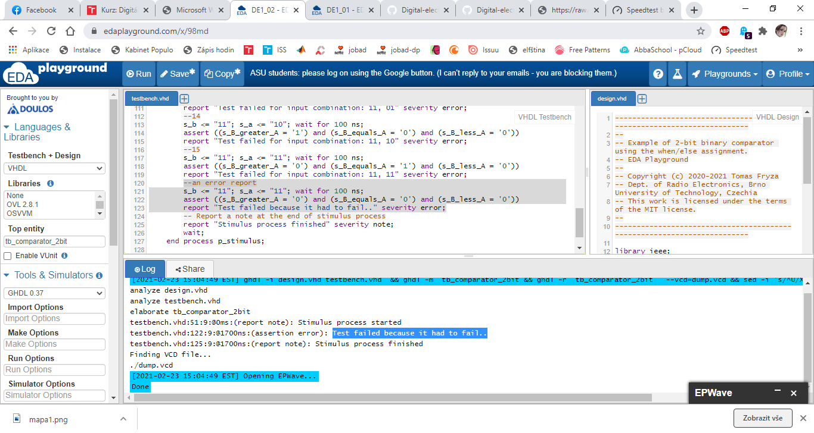

## LAB 2
1. 2-bit comparator table

 **Dec. equivalent** | **B[1:0]** | **A[1:0]** | **B is greater than A** | **B equals A** | **B is less than A** 
 ------------------- | ---------- | ---------- | ----------------------- | -------------- | -------------------- 
 0 | 0 0 | 0 0 | 0 | 1 | 0 
 1 | 0 0 | 0 1 | 0 | 0 | 1 
 2 | 0 0 | 1 0 | 0 | 0 | 1 
 3 | 0 0 | 1 1 | 0 | 0 | 1 
 4 | 0 1 | 0 0 | 1 | 0 | 0 
 5 | 0 1 | 0 1 | 0 | 1 | 0 
 6 | 0 1 | 1 0 | 0 | 0 | 1 
 7 | 0 1 | 1 1 | 0 | 0 | 1 
 8 | 1 0 | 0 0 | 1 | 0 | 0 
 9 | 1 0 | 0 1 | 1 | 0 | 0 
 10 | 1 0 | 1 0 | 0 | 1 | 0 
 11 | 1 0 | 1 1 | 0 | 0 | 1 
 12 | 1 1 | 0 0 | 1 | 0 | 0 
 13 | 1 1 | 0 1 | 1 | 0 | 0 
 14 | 1 1 | 1 0 | 1 | 0 | 0 
 15 | 1 1 | 1 1 | 0 | 1 | 0 

2. 2-bit comparator
 * Karnaugh maps and simplified forms:
  
  
 * https://www.edaplayground.com/x/98md
3.Code...
  Design
  ```vhdl
  ------------------------------------------------------------------------
--
-- Example of basic OR, AND, XOR gates.
-- Nexys A7-50T, Vivado v2020.1, EDA Playground
--
-- Copyright (c) 2019-2020 Tomas Fryza
-- Dept. of Radio Electronics, Brno University of Technology, Czechia
-- This work is licensed under the terms of the MIT license.
--
------------------------------------------------------------------------

library ieee;               -- Standard library
use ieee.std_logic_1164.all;-- Package for data types and logic operations

------------------------------------------------------------------------
-- Entity declaration for basic gates
------------------------------------------------------------------------
entity gates is
    port(
        a_i    : in  std_logic;         -- Data input
        b_i    : in  std_logic;         -- Data input
        c_i	 : in  std_logic;
        f_o  : out std_logic;         -- OR output function
        fnand_o : out std_logic;         -- AND output function
        fnor_o : out std_logic          -- XOR output function
    );
end entity gates;

------------------------------------------------------------------------
-- Architecture body for basic gates
------------------------------------------------------------------------
architecture dataflow of gates is
begin
    --for_o  <= a_i or b_i;
    --fand_o <= a_i and b_i;
    --fxor_o <= a_i xor b_i;
	f_o <= ((not b_i) and a_i) or ((not c_i) and (not b_i));
    fnand_o <= (not ((not ((not b_i) and a_i)) and (not ((not c_i) and (not b_i)))));
    fnor_o <= (not (b_i or (not a_i))) or (not (c_i or b_i));
end architecture dataflow;
```

Test:
```vhdl
------------------------------------------------------------------------
--
-- Testbench for 2-bit binary comparator.
-- EDA Playground
--
-- Copyright (c) 2020-2021 Tomas Fryza
-- Dept. of Radio Electronics, Brno University of Technology, Czechia
-- This work is licensed under the terms of the MIT license.
--
------------------------------------------------------------------------

library ieee;
use ieee.std_logic_1164.all;

------------------------------------------------------------------------
-- Entity declaration for testbench
------------------------------------------------------------------------
entity tb_comparator_2bit is
    -- Entity of testbench is always empty
end entity tb_comparator_2bit;

------------------------------------------------------------------------
-- Architecture body for testbench
------------------------------------------------------------------------
architecture testbench of tb_comparator_2bit is

    -- Local signals
    signal s_a       : std_logic_vector(2 - 1 downto 0);
    signal s_b       : std_logic_vector(2 - 1 downto 0);
    signal s_B_greater_A : std_logic;
    signal s_B_equals_A  : std_logic;
    signal s_B_less_A    : std_logic;

begin
    -- Connecting testbench signals with comparator_2bit entity (Unit Under Test)
    uut_comparator_2bit : entity work.comparator_2bit
        port map(
            a_i           => s_a,
            b_i           => s_b,
            B_greater_A_o => s_B_greater_A,
            B_equals_A_o  => s_B_equals_A,
            B_less_A_o    => s_B_less_A
        );

    --------------------------------------------------------------------
    -- Data generation process
    --------------------------------------------------------------------
    p_stimulus : process
    begin
        -- Report a note at the beginning of stimulus process
        report "Stimulus process started" severity note;


        -- First test values
        s_b <= "00"; s_a <= "00"; wait for 100 ns;
        -- Expected output
        assert ((s_B_greater_A = '0') and (s_B_equals_A = '1') and (s_B_less_A = '0'))
        -- If false, then report an error
        report "Test failed for input combination: 00, 00" severity error;
        --1
		s_b <= "00"; s_a <= "01"; wait for 100 ns;
        assert ((s_B_greater_A = '0') and (s_B_equals_A = '0') and (s_B_less_A = '1'))
        report "Test failed for input combination: 00, 01" severity error;
		--2
        s_b <= "00"; s_a <= "10"; wait for 100 ns
        assert ((s_B_greater_A = '0') and (s_B_equals_A = '0') and (s_B_less_A = '1'))
        report "Test failed for input combination: 00, 10" severity error;
        --3
        s_b <= "00"; s_a <= "11"; wait for 100 ns;
        assert ((s_B_greater_A = '0') and (s_B_equals_A = '0') and (s_B_less_A = '1'))
        report "Test failed for input combination: 00, 11" severity error;
        --4
        s_b <= "01"; s_a <= "00"; wait for 100 ns;
        assert ((s_B_greater_A = '1') and (s_B_equals_A = '0') and (s_B_less_A = '0'))
        report "Test failed for input combination: 01, 00" severity error;
        --5
        s_b <= "01"; s_a <= "01"; wait for 100 ns;
        assert ((s_B_greater_A = '0') and (s_B_equals_A = '1') and (s_B_less_A = '0'))
        report "Test failed for input combination: 01, 01" severity error;
        --6
        s_b <= "01"; s_a <= "10"; wait for 100 ns;
        assert ((s_B_greater_A = '0') and (s_B_equals_A = '0') and (s_B_less_A = '1'))
        report "Test failed for input combination: 01, 10" severity error;
        --7
        s_b <= "01"; s_a <= "11"; wait for 100 ns;
        assert ((s_B_greater_A = '0') and (s_B_equals_A = '0') and (s_B_less_A = '1'))
        report "Test failed for input combination: 01, 11" severity error;
        --8
        s_b <= "10"; s_a <= "00"; wait for 100 ns;
        assert ((s_B_greater_A = '1') and (s_B_equals_A = '0') and (s_B_less_A = '0'))
        report "Test failed for input combination: 10, 00" severity error;
        --9
        s_b <= "10"; s_a <= "01"; wait for 100 ns;
        assert ((s_B_greater_A = '1') and (s_B_equals_A = '0') and (s_B_less_A = '0'))
        report "Test failed for input combination: 10, 01" severity error;
		    --10
        s_b <= "10"; s_a <= "10"; wait for 100 ns;
        assert ((s_B_greater_A = '0') and (s_B_equals_A = '1') and (s_B_less_A = '0'))
        report "Test failed for input combination: 10, 10" severity error;
        --11
        s_b <= "10"; s_a <= "11"; wait for 100 ns;
        assert ((s_B_greater_A = '0') and (s_B_equals_A = '0') and (s_B_less_A = '1'))
        report "Test failed for input combination: 10, 11" severity error;
        --12
        s_b <= "11"; s_a <= "00"; wait for 100 ns;
        assert ((s_B_greater_A = '1') and (s_B_equals_A = '0') and (s_B_less_A = '0'))
        report "Test failed for input combination: 11, 00" severity error;
        --13
        s_b <= "11"; s_a <= "01"; wait for 100 ns;
        assert ((s_B_greater_A = '1') and (s_B_equals_A = '0') and (s_B_less_A = '0'))
        report "Test failed for input combination: 11, 01" severity error;
        --14
        s_b <= "11"; s_a <= "10"; wait for 100 ns;
        assert ((s_B_greater_A = '1') and (s_B_equals_A = '0') and (s_B_less_A = '0'))
        report "Test failed for input combination: 11, 10" severity error;
        --15
        s_b <= "11"; s_a <= "11"; wait for 100 ns;
        assert ((s_B_greater_A = '0') and (s_B_equals_A = '1') and (s_B_less_A = '0'))
        report "Test failed for input combination: 11, 11" severity error;
        --en error report
        s_b <= "11"; s_a <= "11"; wait for 100 ns;
        assert ((s_B_greater_A = '0') and (s_B_equals_A = '0') and (s_B_less_A = '0'))
        report "Test failed because it had to fail.." severity error;
        -- Report a note at the end of stimulus process
        report "Stimulus process finished" severity note;
        wait;
    end process p_stimulus;

end architecture testbench;
```
  printscreen:
  
 
