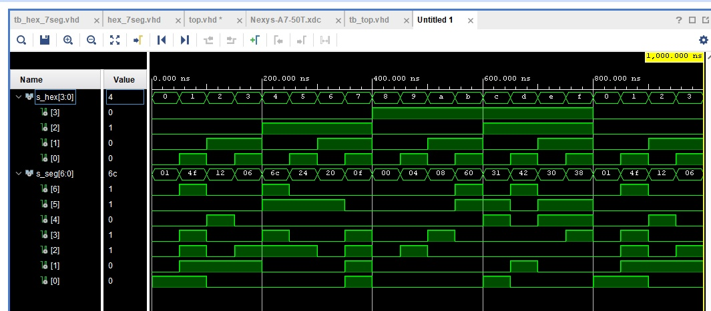
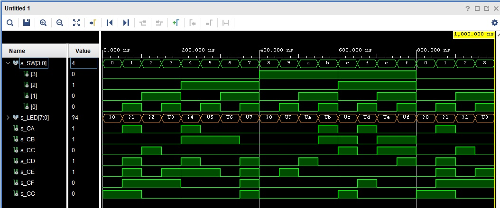

## Lab 4
# 1. Preparation tasks
     * Figure or table with connection of 7-segment displays on Nexys A7 board
       
     * Decoder truth table common anode
| **Hex** | **Inputs** | **A** | **B** | **C** | **D** | **E** | **F** | **G** |
| :-: | :-: | :-: | :-: | :-: | :-: | :-: | :-: | :-: |
| 0 | 0000 | 0 | 0 | 0 | 0 | 0 | 0 | 1 |
| 1 | 0001 | 1 | 0 | 0 | 1 | 1 | 1 | 1 |
| 2 | 0010 | 0 | 0 | 1 | 0 | 0 | 1 | 0 |
| 3 | 0011 | 0 | 0 | 0 | 0 | 1 | 1 | 0 |
| 4 | 0100 | 1 | 1 | 0 | 1 | 1 | 0 | 0 |
| 5 | 0101 | 0 | 1 | 0 | 0 | 1 | 0 | 0 |
| 6 | 0110 | 0 | 1 | 0 | 0 | 0 | 0 | 0 |
| 7 | 0111 | 0 | 0 | 0 | 1 | 1 | 1 | 1 |
| 8 | 1000 | 0 | 0 | 0 | 0 | 0 | 0 | 0 |
| 9 | 1001 | 0 | 0 | 0 | 0 | 1 | 0 | 0 |
| A | 1010 | 0 | 0 | 0 | 1 | 0 | 0 | 0 |
| b | 1011 | 1 | 1 | 0 | 0 | 0 | 0 | 0 |
| C | 1100 | 0 | 1 | 1 | 0 | 0 | 0 | 1 |
| d | 1101 | 1 | 0 | 0 | 0 | 0 | 1 | 0 |
| E | 1110 | 0 | 1 | 1 | 0 | 0 | 0 | 0 |
| F | 1111 | 0 | 1 | 1 | 1 | 0 | 0 | 0 |
# 2. Seven-segment display decoder
   * architecture
```vhdl
p_7seg_decoder : process(hex_i)
begin
    case hex_i is
        when "0000" =>
            seg_o <= "0000001";     -- 0
        when "0001" =>
            seg_o <= "1001111";     -- 1
        when "0010" =>
            seg_o <= "0010010";     -- 2
        when "0011" =>
            seg_o <= "0000110";     -- 3
        when "0100" =>
            seg_o <= "1101100";     -- 4
        when "0101" =>
            seg_o <= "0100100";     -- 5
        when "0110" =>
            seg_o <= "0100000";     -- 6
        when "0111" =>
            seg_o <= "0001111";     -- 7
        when "1000" =>
            seg_o <= "0000000";     -- 8
        when "1001" =>
            seg_o <= "0000100";     -- 9
        when "1010" =>
            seg_o <= "0001000";     -- A
        when "1011" =>
            seg_o <= "1100000";     -- B
        when "1100" =>
            seg_o <= "0110001";     -- C
        when "1101" =>
            seg_o <= "1000010";     -- D
        when "1110" =>
            seg_o <= "0110000";     -- E
        when others =>
            seg_o <= "0111000";     -- F
    end case;
end process p_7seg_decoder;
```
    * stimulus
```vhdl
p_stimulus : process
begin
    s_hex <= "0000"; wait for 50ns;
    assert (s_seg = "0000001") report "Test failed for hex input combination: 0000" severity error;
    s_hex <= "0001"; wait for 50 ns;
    assert (s_seg = "1001111") report "Test failed for hex input combination: 0001" severity error;
    s_hex <= "0010"; wait for 50 ns;
    assert (s_seg = "0010010") report "Test failed for hex input combination: 0010" severity error;
    s_hex <= "0011"; wait for 50 ns;
    assert (s_seg = "0000110") report "Test failed for hex input combination: 0011" severity error;
    s_hex <= "0100"; wait for 50 ns;
    assert (s_seg = "1101100") report "Test failed for hex input combination: 0100" severity error;
    s_hex <= "0101"; wait for 50 ns;
    assert (s_seg = "0100100") report "Test failed for hex input combination: 0101" severity error;
    s_hex <= "0110"; wait for 50 ns;
    assert (s_seg = "0100000") report "Test failed for hex input combination: 0110" severity error;
    s_hex <= "0111"; wait for 50 ns;
    assert (s_seg = "0001111") report "Test failed for hex input combination: 0111" severity error;
    s_hex <= "1000"; wait for 50 ns;
    assert (s_seg = "0000000") report "Test failed for hex input combination: 1000" severity error;
    s_hex <= "1001"; wait for 50 ns;
    assert (s_seg = "0000100") report "Test failed for hex input combination: 1001" severity error;
    s_hex <= "1010"; wait for 50 ns;
    assert (s_seg = "0001000") report "Test failed for hex input combination: 1010" severity error;
    s_hex <= "1011"; wait for 50 ns;
    assert (s_seg = "1100000") report "Test failed for hex input combination: 1011" severity error;
    s_hex <= "1100"; wait for 50 ns;
    assert (s_seg = "0110001") report "Test failed for hex input combination: 1100" severity error;
    s_hex <= "1101"; wait for 50 ns;
    assert (s_seg = "1000010") report "Test failed for hex input combination: 1101" severity error;
    s_hex <= "1110"; wait for 50 ns;
    assert (s_seg = "0110000") report "Test failed for hex input combination: 1110" severity error;
    s_hex <= "1111"; wait for 50 ns;
    assert (s_seg = "0111000") report "Test failed for hex input combination: 1111" severity error;
end process p_stimulus;
```
    * testbench

    * top.vhd
```vhdl
architecture Behavioral of top is

begin
   --------------------------------------------------------------------
    -- Instance (copy) of hex_7seg entity
    hex2seg : entity work.hex_7seg
        port map(
            hex_i    => SW,
            seg_o(6) => CA,
            seg_o(5) => CB,
            seg_o(4) => CC,
            seg_o(3) => CD,
            seg_o(2) => CE,
            seg_o(1) => CF,
            seg_o(0) => CG
        );

    -- Connect one common anode to 3.3V
    AN <= b"1111_0111";

    -- Display input value on LEDs
    LED(3 downto 0) <= SW;
```
# 3. LED(7:4) indicators
    * truth table
| **Hex** | **Inputs** | **LED4** | **LED5** | **LED6** | **LED7** |
| :-: | :-: | :-: | :-: | :-: | :-: |
| 0 | 0000 | 1 | 0 | 0 | 0 |
| 1 | 0001 | 0 | 0 | 1 | 1 |
| 2 | 0010 | 0 | 0 | 0 | 1 |
| 3 | 0011 | 0 | 0 | 1 | 0 |
| 4 | 0100 | 0 | 0 | 0 | 1 |
| 5 | 0101 | 0 | 0 | 1 | 0 |
| 6 | 0110 | 0 | 0 | 0 | 0 |
| 7 | 0111 | 0 | 0 | 1 | 0 |
| 8 | 1000 | 0 | 0 | 0 | 1 |
| 9 | 1001 | 0 | 0 | 1 | 0 |
| A | 1010 | 0 | 1 | 0 | 0 |
| b | 1011 | 0 | 1 | 1 | 0 |
| C | 1100 | 0 | 1 | 0 | 0 |
| d | 1101 | 0 | 1 | 1 | 0 |
| E | 1110 | 0 | 1 | 0 | 0 |
| F | 1111 | 0 | 1 | 1 | 0 |
    * code
```vhdl
-- LED(7:4) indicators
-- Turn LED(4) on if input value is equal to 0, ie "0000"
-- WRITE YOUR CODE HERE
LED(4) <= '1' when (SW= "0000") else '0';
-- Turn LED(5) on if input value is greater than "1001", ie 9
-- WRITE YOUR CODE HERE
LED(5) <= '1' when (SW= "1001") else '0';
-- Turn LED(6) on if input value is odd, ie 1, 3, 5, ...
-- WRITE YOUR CODE HERE
LED(6) <= '1' when (SW(0)= '1') else '0';
-- Turn LED(7) on if input value is a power of two, ie 1, 2, 4, or 8
-- WRITE YOUR CODE HERE    
LED(4) <= '1' when (SW = "0001") else 
         '1' when (SW = "0010") else
         '1' when (SW = "0100") else
         '1' when (SW = "1000") else
         '0';
```
    * testbench
