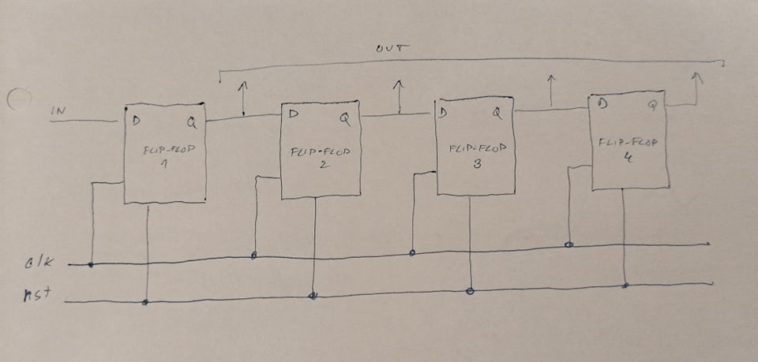

## LAB 7
# 1. Preparation task
* rovnice: D: q(n+1)=d; JK: q(n+1)= j./q(n)+/k.q(n); T: q(n+1)= t./q(n)+/t.q(n)
* tabulky:

| **clk** | **d** | **q(n)** | **q(n+1)** | **Comments** |
| :-: | :-: | :-: | :-: | :-- |
|  | 0 | 0 | 0 | No change |
|  | 0 | 1 | 0 | write d |
|  | 1 | 0 | 1 | write d |
|  | 1 | 1 | 1 | No change |

| **clk** | **j** | **k** | **q(n)** | **q(n+1)** | **Comments** |
| :-: | :-: | :-: | :-: | :-: | :-- |
|  | 0 | 0 | 0 | 0 | No change |
|  | 0 | 0 | 1 | 1 | No change |
|  | 0 | 1 | 0 | 0 | Reset |
|  | 0 | 1 | 1 | 0 | Reset |
|  | 1 | 0 | 0 | 1 | Set |
|  | 1 | 0 | 1 | 1 | Set |
|  | 1 | 1 | 0 | 1 | Inverse |
|  | 1 | 1 | 1 | 0 | Inverse |

| **clk** | **t** | **q(n)** | **q(n+1)** | **Comments** |
| :-: | :-: | :-: | :-: | :-- |
|  | 0 | 0 | 0 | No change |
|  | 0 | 1 | 1 | No change |
|  | 1 | 0 | 1 | Inverse |
|  | 1 | 1 | 0 | Inverse |

# 2. D latch
* p_d_latch process
```vhdl
p_d_latch: process (en, d, arst)
begin
    if (arst = '1') then
        q       <= '0';
        q_bar   <= '1';
    elsif (en = '1') then
        q       <= d;
        q_bar   <= not d;
    end if;       
end process p_d_latch;
```
* testbench
```vhdl    
p_reset: process
begin
    s_arst <= '1'; wait for 10ns;
    s_arst <= '0'; wait for 100ns;
    s_arst <= '1'; wait for 50ns;
    s_arst <= '0'; wait for 40ns;
    s_arst <= '1'; wait for 150ns;
    s_arst <= '0'; wait for 150ns;
    s_arst <= '1'; wait;
end process p_reset;

p_simultus: process
begin
    s_d <= '0';
    s_en <= '0';
    --s_q <= '0';
    --s_q_bar <= '0';
    wait for 20ns;
    s_en <= '1'; s_d <= '1'; wait for 100ns;
    s_d <= '0'; wait for 10ns;
    s_d <= '1'; wait for 10ns;
    s_en <= '0'; wait for 10ns;
    s_d <= '0'; wait for 30ns;
    s_en <= '1'; wait for 10ns;
    s_d <= '1'; wait for 10ns;
    s_en <= '1'; s_d <= '1'; wait for 100ns;
    s_d <= '0'; wait for 10ns;
    s_d <= '1'; wait for 10ns;
    s_en <= '0'; wait for 10ns;
    s_d <= '0'; wait for 30ns;
    s_en <= '1'; wait for 10ns;
    s_d <= '1'; wait for 50ns;
    s_en <= '0'; wait;
end process p_simultus;
```
* Screenshot with simulated time waveforms


# 3. Flip-flops
* processes
d_ff_arst
```vhdl
p_d_ff_arst: process (clk, arst)
begin
    if (arst = '1') then
        q       <= '0';
        q_bar   <= '1';
    elsif rising_edge(clk) then
        q       <= d;
        q_bar   <= not d;
    end if;       
end process p_d_ff_arst;
```
d_ff_rst
```vhdl
p_d_ff_rst: process (clk, rst)
 begin
    if rising_edge(clk) then
      if (rst = '1') then
        q <= '0';
        q_bar <= '1';
      else
        q <= d;
        q_bar <= not d;
      end if;          
    end if;    
end process p_d_ff_rst;
```
jk_ff_rst
```vhdl
p_jk_ff_rst: process (clk)
begin
    if rising_edge(clk) then
        if (rst = '1') then
            s_q       <= '0';
        else
            if (j = '0' and k = '0') then
                s_q       <= s_q;
            elsif (j = '0' and k = '1') then
                s_q       <= '0'; 
            elsif (j = '1' and k = '0') then
                s_q       <= '1';
            else
                s_q       <= not s_q;    
            end if;
        end if;
    end if;           
end process p_jk_ff_rst;
q <= s_q;
q_bar <= not s_q;
```
t_ff_rst
```vhdl
p_t_ff_rst: process(clk)
begin   
    if rising_edge(clk) then 
      if (rst = '1') then 
        s_q <= '0';
      elsif (t = '1') then
        s_q <= not s_q;  
      end if;  
    end if;
end process p_t_ff_rst;
q <= s_q;
q_bar <= not s_q;
```
* testbench files
d_ff_arst
```vhdl
p_clk_gen : process
begin
    while now < 750 ns loop         -- 75 periods of 100MHz clock
        s_clk <= '0';
        wait for c_CLK_100MHZ_PERIOD / 2;
        s_clk <= '1';
        wait for c_CLK_100MHZ_PERIOD / 2;
    end loop;
    wait;
end process p_clk_gen;

p_reset: process
begin
    s_arst <= '1'; wait for 10ns;
    s_arst <= '0'; wait for 100ns;
    s_arst <= '1'; wait for 50ns;
    s_arst <= '0'; wait for 40ns;
    s_arst <= '1'; wait for 150ns;
    s_arst <= '0'; wait for 150ns;
    s_arst <= '1'; wait;
end process p_reset;

p_simultus: process
begin
    s_d <= '1'; wait for 10ns;
    s_d <= '0'; wait for 10ns;
    s_d <= '1'; wait for 10ns;
    s_d <= '0'; wait for 10ns;
    s_d <= '1'; wait for 10ns;
    s_d <= '0'; wait for 10ns;
    s_d <= '1'; wait for 10ns;
    s_d <= '0'; wait for 10ns;
    s_d <= '1'; wait for 100ns;
    s_d <= '0'; wait for 50ns;
    s_d <= '1'; wait for 20ns;
    s_d <= '0'; wait for 10ns;
    wait;
end process p_simultus;
```
d_ff_rst
```vhdl
p_clk_gen : process
begin
    while now < 750 ns loop         -- 75 periods of 100MHz clock
        s_clk <= '0';
        wait for c_CLK_100MHZ_PERIOD / 2;
        s_clk <= '1';
        wait for c_CLK_100MHZ_PERIOD / 2;
    end loop;
    wait;
end process p_clk_gen;

p_reset: process
begin
    s_rst <= '1'; wait for 10ns;
    s_rst <= '0'; wait for 100ns;
    s_rst <= '1'; wait for 50ns;
    s_rst <= '0'; wait for 40ns;
    s_rst <= '1'; wait for 150ns;
    s_rst <= '0'; wait for 150ns;
    s_rst <= '1'; wait;
end process p_reset;

p_simultus: process
begin
    s_d <= '1'; wait for 10ns;
    s_d <= '0'; wait for 10ns;
    s_d <= '1'; wait for 10ns;
    s_d <= '0'; wait for 10ns;
    s_d <= '1'; wait for 10ns;
    s_d <= '0'; wait for 10ns;
    s_d <= '1'; wait for 10ns;
    s_d <= '0'; wait for 10ns;
    s_d <= '1'; wait for 100ns;
    s_d <= '0'; wait for 50ns;
    s_d <= '1'; wait for 20ns;
    s_d <= '0'; wait for 10ns;
    wait;
end process p_simultus;
```
jk_ff_rst
```vhdl
p_clk_gen : process
begin
    while now < 750 ns loop         -- 75 periods of 100MHz clock
        s_clk <= '0';
        wait for c_CLK_100MHZ_PERIOD / 2;
        s_clk <= '1';
        wait for c_CLK_100MHZ_PERIOD / 2;
    end loop;
    wait;
end process p_clk_gen;

p_reset: process
begin
    s_rst <= '1'; wait for 10ns;
    s_rst <= '0'; wait for 100ns;
    s_rst <= '1'; wait for 50ns;
    s_rst <= '0'; wait for 40ns;
    s_rst <= '1'; wait for 150ns;
    s_rst <= '0'; wait for 150ns;
    s_rst <= '1'; wait;
end process p_reset;

p_simultus_j: process
begin
    s_j <= '1'; wait for 10ns;
    s_j <= '0'; wait for 10ns;
    s_j <= '1'; wait for 10ns;
    s_j <= '0'; wait for 10ns;
    s_j <= '1'; wait for 10ns;
    s_j <= '0'; wait for 10ns;
    s_j <= '1'; wait for 10ns;
    s_j <= '0'; wait for 10ns;
    s_j <= '1'; wait for 100ns;
    s_j <= '0'; wait for 50ns;
    s_j <= '1'; wait for 20ns;
    s_j <= '0'; wait for 10ns;
    wait;
end process p_simultus_j;

p_simultus_k: process
begin
    s_k <= '1'; wait for 10ns;
    s_k <= '0'; wait for 10ns;
    s_k <= '1'; wait for 100ns;
    s_k <= '0'; wait for 50ns;
    s_k <= '1'; wait for 20ns;
    s_k <= '0'; wait for 10ns;
    s_k <= '1'; wait for 10ns;
    s_k <= '0'; wait for 10ns;
    s_k <= '1'; wait for 10ns;
    s_k <= '0'; wait for 10ns;
    s_k <= '1'; wait for 10ns;
    s_k <= '0'; wait for 10ns;
    
    wait;
end process p_simultus_k;
```
t_ff_rst
```vhdl
p_clk_gen : process
begin
    while now < 750 ns loop         -- 75 periods of 100MHz clock
        s_clk <= '0';
        wait for c_CLK_100MHZ_PERIOD / 2;
        s_clk <= '1';
        wait for c_CLK_100MHZ_PERIOD / 2;
    end loop;
    wait;
end process p_clk_gen;

p_reset: process
begin
    s_rst <= '1'; wait for 10ns;
    s_rst <= '0'; wait for 100ns;
    s_rst <= '1'; wait for 50ns;
    s_rst <= '0'; wait for 40ns;
    s_rst <= '1'; wait for 150ns;
    s_rst <= '0'; wait for 150ns;
    s_rst <= '1'; wait;
end process p_reset;

p_simultus: process
begin
    s_t <= '1'; wait for 10ns;
    s_t <= '0'; wait for 10ns;
    s_t <= '1'; wait for 10ns;
    s_t <= '0'; wait for 10ns;
    s_t <= '1'; wait for 10ns;
    s_t <= '0'; wait for 10ns;
    s_t <= '1'; wait for 10ns;
    s_t <= '0'; wait for 10ns;
    s_t <= '1'; wait for 100ns;
    s_t <= '0'; wait for 50ns;
    s_t <= '1'; wait for 20ns;
    s_t <= '0'; wait for 10ns;
    wait;
end process p_simultus;
```
* simulations


# 4. Shift register

